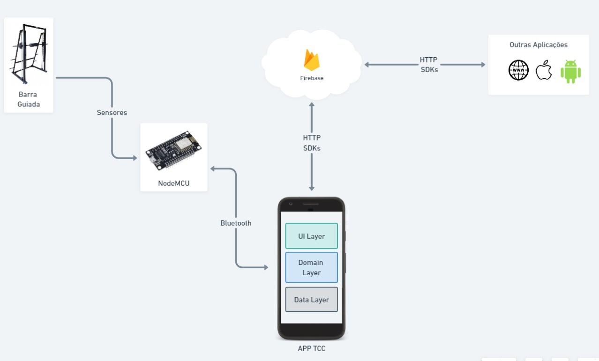

# Push App API 💪

### Overview

---

Aplicaçã desenvolvida para estudar a linguagem Go com o intuito de criar uma Api para servir a aplicação Android [PushApp](https://github.com/henriquemelo01/push-app). 
O projeto PushApp esta sendo desenvolvido para o trabalho de conclusão do Curso de Engenharia de Controle e Automação.

---

### Arquitetura

